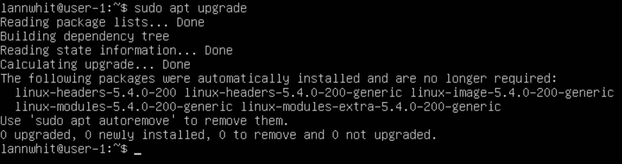
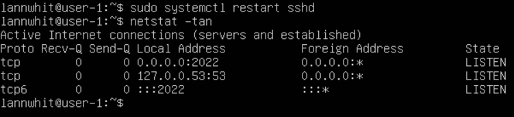
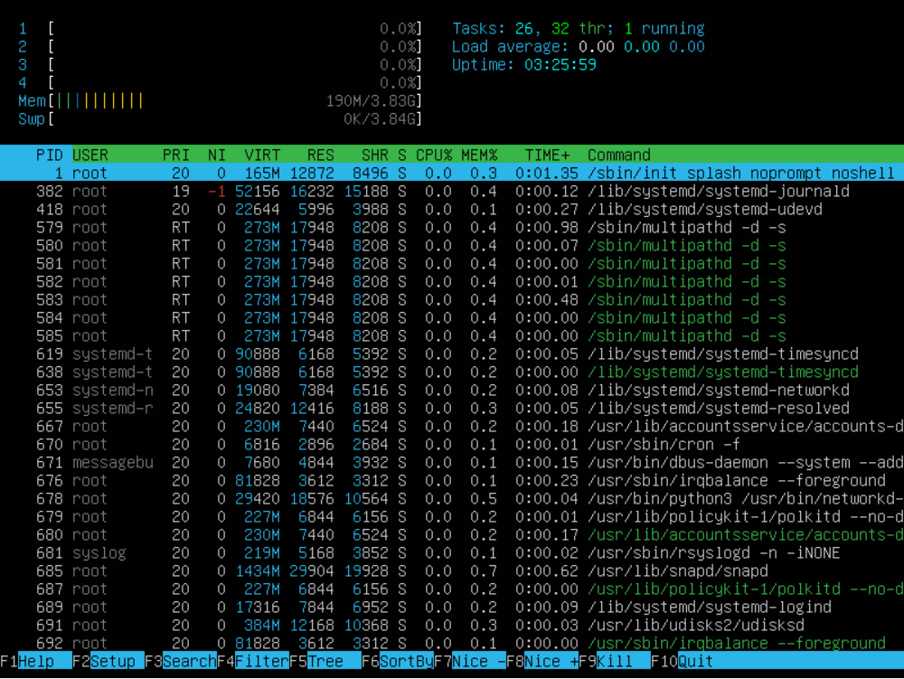
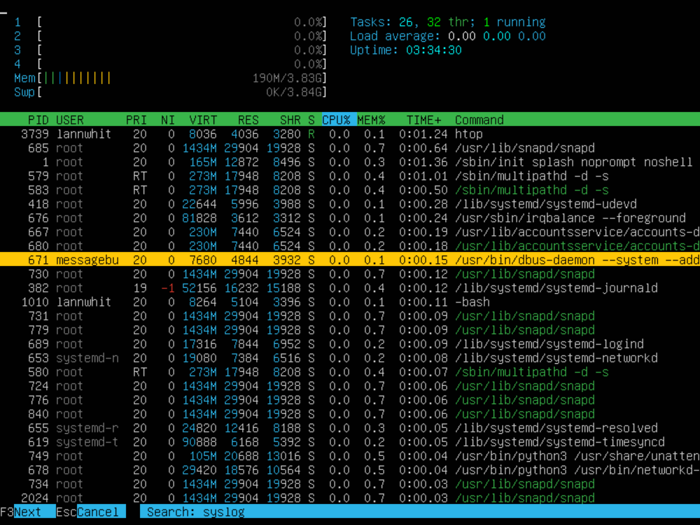
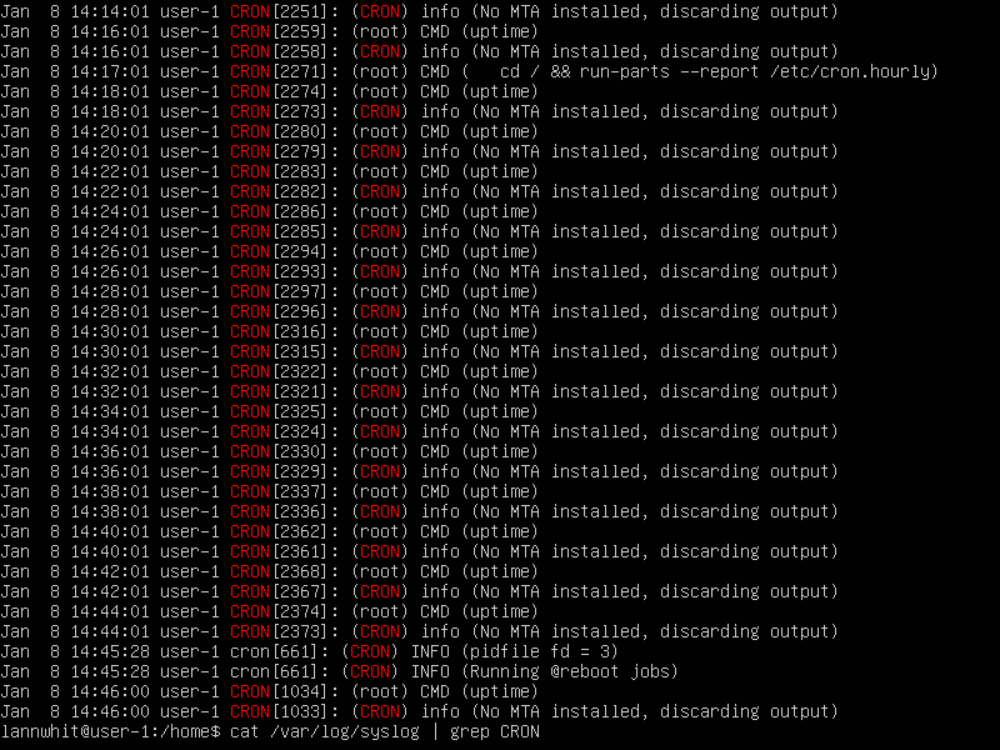

# Работа с Ubuntu 20.04 Server LTS

## Содержание
1. [Установка ОС](#часть-1-установка-ос) 

## Часть 1. Установка ОС

- Скачать установочный образ ОС (iso) https://old-releases.ubuntu.com/releases/20.04/
- Скачать программу для виртуализации https://www.virtualbox.org/wiki/Downloads
- Создание виртуальной машины (ВМ)
  - Запустить VirtualBox 
  - Нажать Создать
  - Задать имя ВМ - `d01-linux-1`
  - Выбрать образ iso - `ubuntu-20.04-live-server-amd64.iso` -> Далее
  - Задать имя пользователя и пароль. Задать имя хоста -> Далее
  - Задать количество оперативной памяти. Задать количество процессоров -> Далее
  - Создать новый виртуальный диск. Выбрать размер диска -> Далее -> Готово
- Установка ОС
  - Запускаем созданную машину в VirtualBox
  - Выбрать язык
  - Продолжить без обновления
  - Выбрать раскладку клавиатуру -> Готово
  - Настройка сети -> Готово
  - Настройка прокси-сервера -> Готово
  - Настройка сервера обновлений -> Готово
  - Разметка диска -> Готово
  - Конфигуратор хранилища -> Готово
  - Подтвердить разрушительное действие -> Продолжить
  - Настройка учетной записи
    - Задать имя
    - Задать название сервера
    - Задать имя пользователя и пароль
    - Готово
  - Подтверждаем необходимость установки OpenSSH сервера
  - Импортировать идентификатор SSH - НЕТ -> Готово
  - Выбираем рекомендуемые снимки сервера -> Готово
  - Выбор компонентов сервера -> Готово
  - Установка завершена - Ожидаем скачивание и установку обновлений систем безопасности
  - По окончании установки -> Перезагрузка
- Ввести логин и пароль
- Узнать версию Ubuntu, выполнив команду `cat /etc/issue.`

>Разультат работы команды `cat /etc/issue`.

 

## Часть 2. Создание пользователя

- Создание нового пользователя в группе adm

>Вызов команды для создания пользователя.

>Разультат работы команды `cat /etc/passwd`.

 

## Часть 3. Настройка сети ОС

- Задать название машины вида user-1

>Вызов команды для переименования машины.

>После перезагрузки системы hostname изменился

- Установить временную зону, соответствующую вашему текущему местоположению.

>Вызов команды для установки временной зоны.

- Вывести названия сетевых интерфейсов с помощью консольной команды.

>Вызов команды для вывода названий сетевых интерфейсов.

`lo` - loopback interface - это виртуальный сетевой интерфейс, который компьютер использует для связи с самим собой при работе серверных приложений.

- Используя консольную команду получить ip адрес устройства, на котором вы работаете, от DHCP сервера.

>Вызов команды для получения ip адреса текущего устройства от DHCP-сервера.

`DHCP` - Dynamic Host Configuration Protocol  - протокол динамической настройки узла.

- Определить и вывести на экран внешний ip-адрес шлюза (ip) и внутренний IP-адрес шлюза, он же ip-адрес по умолчанию (gw).

>Вызов команд для определения внешнего ip-адреса шлюза.

>Вызов команд для определения внутреннего ip-адреса шлюза.

- Задать статичные (заданные вручную, а не полученные от DHCP сервера) настройки ip, gw, dns (использовать публичный DNS серверы, например 1.1.1.1 или 8.8.8.8).

>Для изменения настроек вводим команду `
`, отключаем dhcp и добавляем адреса. 

- Перезагрузить виртуальную машину. Убедиться, что статичные сетевые настройки (ip, gw, dns) соответствуют заданным в предыдущем пункте.

      sudo reboot

>Пинг удаленных хостов 1.1.1.1 и ya.ru.

 

## Часть 4. Обновление ОС

- Обновить системные пакеты до последней на момент выполнения задания версии.

      sudo apt update

      sudo apt upgrade 

>Вызов команды обновления ( sudo apt update )

>Процесс апргрейда пакетов ( sudo apt upgrade ). Забыл сделать скриншот с указанием самой команды sudo apt upgrade.

>Апгрейд окончен, показываю последнюю использованную команду, т.е sudo apt upgrade .

>Вызов команды обновления повторно, для подтверждения отсутствия обновления.

 

## Часть 5. Использование команды **sudo**

- Разрешить пользователю, созданному в [Часть 2](#часть-2-создание-пользователя), выполнять команду sudo

      sudo usermod -aG sudo localuser

`sudo` - Super User DO - позволяет строго определенным пользователям выполнять команды с правами администратора.

- Поменять hostname ОС от имени пользователя, созданного в пункте [Часть 2](#часть-2-создание-пользователя) (используя sudo).

>Создание пароля ранее созданному пользователю и вызов команды для переименования машины.

 

## Часть 6. Установка и настройка службы времени

- Настроить службу автоматической синхронизации времени.

      sudo apt install ntpdate

      sudo ntpdate -qu 1.ro.pool.ntp.org

>Вызов команды для вывода времени и часового пояса.

 

## Часть 7. Установка и использование текстовых редакторов 

- Установить текстовой редактор **VIM**.

      sudo apt install vim

- Cоздать файл *test_VIM.txt*. Написать в нём свой никнейм, закрыть файл с сохранением изменений.

      touch test_VIM.txt
      vim test_VIM.txt

>Cодержимое файла test_VIM.txt перед закрытием. Для редактирования файла нажать `i`. После ввода текста `esc`. Для выхода с сохранением изменений `:wq` или `ZZ`.

- Отредактировать файл, заменив никнейм на строку "21 School 21", закрыть файл без сохранения изменений

>Cодержимое файла test_VIM.txt после редактирования. Редактирование файла: удаляем первую строку `dd`, затем входим в режим редактирования `i`, набираем текст. После редактирования `esc`. Для выхода без сохранениния изменений `:q!`.

- Поиск по содержимому файла.

>Команда для замены слова на другое `:s/<find_text>/<replace_text>`.

- Замена слова на любое другое.

***
 

- Установить текстовой редактор **NANO**.

      sudo apt install nano

- Cоздать файл *test_NANO.txt*. Написать в нём свой никнейм, закрыть файл с сохранением изменений.

      touch test_NANO.txt
      nano test_NANO.txt

>Cодержимое файла test_NANO.txt перед закрытием. Для редактирования вводить текст. Для выхода с сохранением изменений `control + x` ( Part_7_5.png ), затем `y` и `enter`.

- Отредактировать файл, заменив никнейм на строку "21 School 21", закрыть файл без сохранения изменений

>Cодержимое файла test_NANO.txt после редактирования. Редактирование файла: удаляем первую строку, затем набираем текст. Для выхода без сохранениния изменений `control + x`, затем `n`.

- Поиск по содержимому файла.

>Команда для замены слова на другое `control + \`, вводим искомое слово, затем `enter`, вводим замену, `enter`, и `y`.

***
 

- Установить текстовой редактор **MCEDIT**.

      sudo apt install mcedit

- Cоздать файл *test_MCEDIT.txt*. Написать в нём свой никнейм, закрыть файл с сохранением изменений.

      touch test_MCEDIT.txt
      mcedit test_MCEDIT.txt

>Cодержимое файла test_MCEDIT.txt перед закрытием. Для редактирования вводить текст. Для выхода с сохранением изменений `esc` или `F10`, затем выбрать `Да`.

- Отредактировать файл, заменив никнейм на строку "21 School 21", закрыть файл без сохранения изменений

>Cодержимое файла test_MCEDIT.txt после редактирования. Редактирование файла: удаляем первую строку, затем набираем текст. Для выхода без сохранениния изменений `esc` или `F10`, затем выбрать `Нет`.

- Поиск по содержимому файла.

>Результаты поиска слова. Поиск осуществляется через нажатие `F7` и ввода искомого слова, затем `enter`, курсор должен находится перед искомым словом.

- Замена слова на любое другое.

>Команда для замены слова на другое `F4`, вводим искомое слово, вводим зеамену, `enter`, и еще раз `enter`.

>Список трёх файлов с разными редакторами.

 

## Часть 8. Установка и базовая настройка сервиса **SSHD**

- Установить службу SSHd.

      sudo apt update
      sudo apt install ssh
      sudo apt install openssh-server

- Добавить автостарт службы при загрузке системы.

      sudo systemctl enable ssh

- Перенастроить службу SSHd на порт 2022.

      sudo vim /etc/ssh/sshd_config

>Меняем *#Port 22* на *Port 2022*

      sudo systemctl restart sshd

- Используя команду ps, показать наличие процесса sshd.

>Вызов команды для вывода процесса по его имени.

`ps` - команда, которая выводит статистику и информацию о состоянии процессов в системе, в том числе ИД процесса или нити, объем выполняемого ввода-вывода и используемый объем ресурсов процессора и памяти. \
Список ключей: \
-A, -e, (a) - выбрать все процессы; \
-a - выбрать все процессы, кроме фоновых; \
-d, (g) - выбрать все процессы, даже фоновые, кроме процессов сессий; \
-N - выбрать все процессы кроме указанных; \
-С - выбирать процессы по имени команды; \
-G - выбрать процессы по ID группы; \
-p, (p) - выбрать процессы PID; \
--ppid - выбрать процессы по PID родительского процесса; \
-s - выбрать процессы по ID сессии; \
-t, (t) - выбрать процессы по tty; \
-u, (U) - выбрать процессы пользователя.

- Перезагрузить систему.

      sudo reboot

- Вывод команды netstat -tan

      sudo apt install net-tools

>Вызов команды для вывода списка открытых портов и соответствующих им адресов, таблиц маршрутизации и скрытых соединений. \
Список ключей: \
-t - Отображение текущего подключения в состоянии переноса нагрузки с процессора на сетевой адаптер при передаче данных ( "offload" ); \
-a - Отображение всех подключений и ожидающих портов; \
-n - Отображение адресов и номеров портов в числовом формате.

`Proto` - Протокол, используемый сокетом.

`Recv-Q` - Счётчик байт не скопированных программой пользователя из этого сокета.

`Send-Q` - Счётчик байтов, не подтверждённых удалённым узлом.

`Local Address` - Адрес и номер порта локального конца сокета. Если не указана опция --numeric (-n), адрес сокета преобразуется в каноническое имя узла (FQDN), и номер порта преобразуется в соответствующее имя службы.

`Foreign Address` - Адрес и номер порта удалённого конца сокета. Аналогично "Local Address."

`State` - Состояние сокета.

`0.0.0.0` -  это немаршрутизируемый адрес IPv4, который используется в качестве адреса по умолчанию или адреса-заполнителя.

 

## Часть 9. Установка и использование утилит **top**, **htop**

- Установить и запустить утилиты top. 

      top

>Вызов команды top. \
uptime - 8:00 \
количество авторизованных пользователей - 1 \
общая загрузка системы - 0.06, 0.09, 0.06\
общее количество процессов - 150 \
загрузка cpu - 0.0 us, 0.0 sy, 0.0 ni, 100.0 id, 0.0 wa, 0.0 hi, 0.0 si, 0.0 st \
загрузка памяти - 9615.4 total, 8697.8 free, 227.4 used, 960.2 buff/cache \
pid процесса занимающего больше всего памяти - 1\
pid процесса, занимающего больше всего процессорного времени - 1

- Установить и запустить утилиты htop. 

      htop

>Вызов команды htop и сортировка по PID

>Cортировка по PERCENT_CPU

>Сортировка по PERCENT_MEM

>Сортировка по TIME

>Фильтр по sshd

>Поиск по syslog

>Добавлен вывод hostname, clock и uptime

 

## Часть 10. Использование утилиты **fdisk**

- Запустить команду fdisk -l.

      sudo fdisk -l

>Вызов команды для получения информации о жёстком диске. \

>Вызов команды для получения информации о размере swap на жёстком диске.

 

## Часть 11. Использование утилиты **df** 

- Запустить команду df.

>Вызов команды для получения информации о дисковом пространстве. \

- Запустить команду df -Th.

>Вызов команды для получения информации о дисковом пространстве с типом файловой системы и размерами в читаемом виде. \

 

## Часть 12. Использование утилиты **du**

- Запустить команду du.

>Вызов команды для получения информации о размере всех файлов в определённой папке

- Вывести размер папок /home, /var, /var/log (в байтах, в человекочитаемом виде)

>Вызов команды для получения информации о размере папок /home, /var, /var/log в байтах.

>Вызов команды для получения информации о размере папок /home, /var, /var/log в человекочитаемом виде.

- Вывести размер всего содержимого в /var/log (не общее, а каждого вложенного элемента, используя *)

>Вызов команды для получения информации о размере всего содержимого в /var/log в человекочитаемом виде.

 

## Часть 13. Установка и использование утилиты **ncdu**

- Установить утилиту ncdu.

      sudo apt install ncdu

- Вывести размер папок /home, /var, /var/log.

>Вызов команды для получения информации о размере папки /home.

>Вызов команды для получения информации о размере папки /var.

>Вызов команды для получения информации о размере папки /var/log.

 

## Часть 14. Работа с системными журналами

- Открыть для просмотра /var/log/dmesg

>Вывод файла vim /var/log/dmesg

- Открыть для просмотра /var/log/syslog

>Вывод файла vim /var/log/syslog

- Открыть для просмотра /var/log/auth.log

>Вывод файла vim /var/log/auth.log

- Перезапустить службу SSHd.

      sudo systemctl restart sshd

>Вывод файла /var/log/syslog с сообщением о рестарте службы SSHd.

 

## Часть 15. Использование планировщика заданий **CRON**

- Используя планировщик заданий, запустите команду uptime через каждые 2 минуты.

      crontab -e

>Редактирование планировщика задач, путем добавления новой строки с текстом `*/2 * * * * uptime`.

- Найти в системных журналах строчки (минимум две в заданном временном диапазоне) о выполнении.

>Вывод данных из файла /var/log/syslog со строками о выполнении запуска команды uptime через каждые 2 минуты.

- Вывести на экран список текущих заданий для CRON.

>Вывод списка текущих заданий для CRON.

>Удаление всех заданий планировщика и вывод списка текущих заданий для CRON.